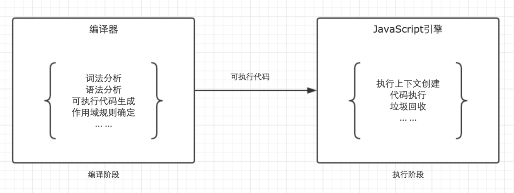
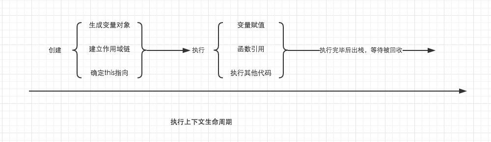
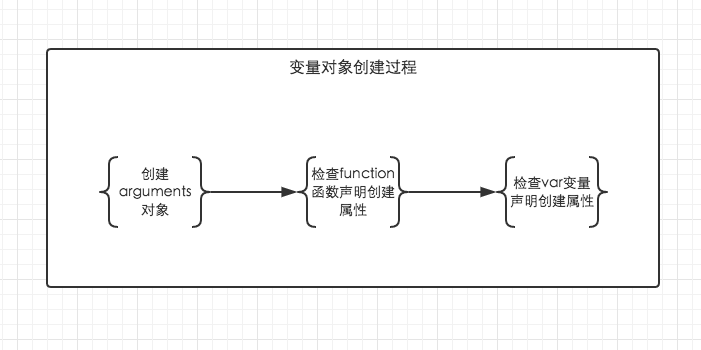

> javascript代码的整个执行过程分为两个阶段： **代码编译** 阶段与 **代码执行** 阶段。
编译阶段由 **编译器** 完成，将代码翻译成可执行代码，这个阶段 **作用域规则** 会确定。
执行阶段由 **引擎** 完成，主要任务是执行可执行代码，**执行上下文** 在这个阶段创建。



> 当调用一个函数时（激活），一个新的执行上下文就会被创建。而一个执行上下文生命周期可以分为两个阶段： **创建**阶段 与 **代码执行**阶段.创建阶段，执行上下文会分别创建 <font style='color:red'> 变量对象 </font> ，建立<font style='color:red'> 作用域链 </font>, 确定<font style='color:red'> this指向 </font>。代码执行阶段，<font style='color:red'> 变量赋值，函数引用，执行其他代码</font>。



> 变量对象的创建，依次经历下面几个过程。<br />
1.建立arguments对象。<br />
2.检查当前上下文的函数声明（function关键字声明的函数），在变量对象中以函数名建立一个属性，如果函数名的属性已经存在，则该属性被新的引用所覆盖。<br />
3.检查当前上下文中的变量声明，每找到一个变量声明，就在变量对象中以变量名建立一个属性，值为undefined。如果该属性已经存在，为防止同名函数被修改为undefined则会直接跳过，原属性不会被修改。



> 未进入执行阶段之前，变量对象中的属性都不能访问！但是进入执行阶段后，<font style='color:red'>变量对象</font>转变为了<font style='color:red'>活动对象</font>, 里面的属性都能被访问了，然后开始进行执行阶段的操作。

# 使用toString判断数据类型

>判断基本数据类型 第一个会想到**typeof**操作符,对于复杂的数据类型一律返回object，而使用 _toString_ 方法在这里可以做一个很好的补充。

<font color=#00ff00>问：为什么要使toString.call(arr)，而不能直接使用arr.toString() ？</font>

```js
var arr = [1,2,3];
toString.call(arr);
arr.toString();

```
输出：


<font color=#00ff00>答：因为arr对象重写了toString方法, 而访问不到**Object**对象中的 toString 方法，而toString.call直接调用的是Object对象的方法</font>


# chrome 控制台最后一行输出的是 表达式或语句返回的值

# svg向下兼容优雅降级技术
1. image标签降级技术
```html
<svg>
    <image xlink:href="svg.svg" src="svg.png" />
</svg>

```
2. Modernizr库
使用svg作为background-image
```css
.mysvg{
    background-image: url(image.svg);
}
.no-svg .mysvg{
    background-image: url(image.png);
}

//css3多背景
.mysvg{
    background-image: url(image.png);
    background-image: url(image.svg), none;
}

```
3. 使用\<object>标签需要对不支持svg的浏览器进行判断
```html
<object> type="image/svg+xml" data="image.svg" class="mysvg"></object>
```
```css
.no-svg .mysvg{
    display: block;
    background-img: url(image.png);
}
```
4. svg作为\
```html

```
或
```js
if(!Modernizr.svg){
    $("img[src$='.svg']").attr('src', fallback);
}
```
5. "inline"svg
>把SVG代码从SVG文件里拷贝出来，直接粘贴掉HTML里使用，它们跟你直接使用普通图片的效果一样。这样做的好处是图片数据就在HTML页面里，不需要浏览器单独执行一次请求下载它。换句话说，它跟使用Data URI的优势一样。但不好的地方也是一样。比如“臃肿”的页面代码，缓存问题等。

```html
<body>
    <!-- 把SVG代码粘贴到这里，图片会显示出来！  -->
</body>
```