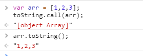

# 使用toString判断数据类型

>判断基本数据类型 第一个会想到**typeof**操作符,对于复杂的数据类型一律返回object，而使用 _toString_ 方法在这里可以做一个很好的补充。

<font color=#00ff00>问：为什么要使toString.call(arr)，而不能直接使用arr.toString() ？</font>

```js
var arr = [1,2,3];
toString.call(arr);
arr.toString();

```
输出：



<font color=#00ff00>答：因为arr对象重写了toString方法, 而访问不到**Object**对象中的 toString 方法，而toString.call直接调用的是Object对象的方法</font>