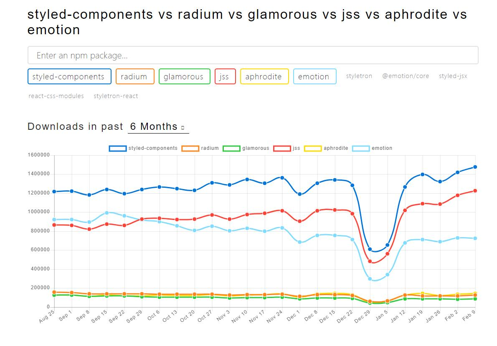
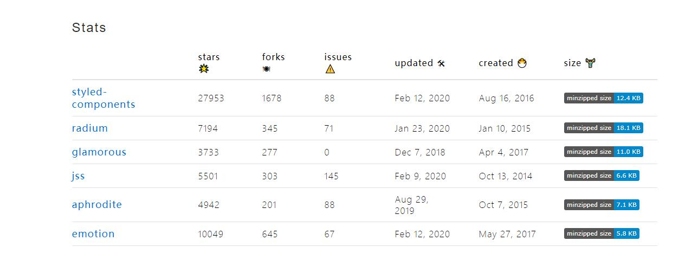

# CSS in JS

## 开发原则：关注点分离
各个技术只负责自己的领域，不混合在一起，形成耦合，而对于前端开发来说就是 HTML JavaScrit CSS的解耦。

## 关注点混合
在React出现后，这个原则（关注点分离）就不再适用了，React是组件结构，强制的把JavaScript、HTML、CSS写在了一起。 这有利于组件的隔离。每个组件包含了所有需要用到的代码，不依赖外部，组件之间没有耦合，很方便复用。所以，随着 React 的走红和组件模式深入人心，这种"关注点混合"的新写法逐渐成为主流。

## 编写CSS时的痛点
1. 全局污染
2. 命名混乱
3. 样式重用困难
4. 代码冗余

## CSS 进化史
* SASS, LESS 让我们可以用程序员思想写样式，解决一些样式重用的冗余问题，但对于命名混乱问题的效果不大。
* BEM 解决了命名混乱和全局污染问题，但是class定义起来不方便，比较冗长，而且与第三方库的命名还是有可能冲突
* CSS Modules 模块化CSS 将CSS文件以模块的形式引入到JavaScript里，基本上解决了全局污染、命名混乱、样式重用和冗余的问题，但是CSS有嵌套解构的限制（只能一层），也无法方便的在CSS和JavaScript之间共享变量。

## 什么是CSS in JS
 style-components是针对React写的一套css in js框架，简单来讲就是在js中写css。相对于与预处理器(sass、less)的好处是，css in js使用的是js语法，不用重新再学习新技术，也不会多一道编译步骤。无疑会加快网页速度。


## 流行的组件库
现在随着组件化概念的流行，对从组件层面维护CSS样式的需求日益增大，**CSS-in-JS就是在组件内部使用JavaScript对CSS进行了抽象，可以对其声明和加以维护**。这样不仅降低了编写CSS样式带来的风险，也让开发变得更加轻松。它和CSS Modules的区别是不再需要CSS样式文件。

### github上使用量比较多的几个组件库





## styled-components
**styled-components 是如何增强CSS对React组件系统进行样式化的结果。 通过聚焦单个用例，设法优化了开发者的体验和面向终端用户的输出。**

除了提升开发者体验外， styled-components同时提供以下特性：

1.	Automatic critical CSS
2.	解决了class name 冲突
3.	CSS更容易移除
4.	简单的动态样式
5.	无痛维护,方便样式维护，只需找到组件，就能快速的改变其样式
6.	自动提供前缀

## 使用styled-component前提条件
使用Facebook create-react-app脚手架创建React 项目

```bash
npm install create-react-app
yarn add create-react-app
```
脚手架安装完毕后 创建项目

```bash
npx create-react-app my-app
npx create-react-app my-app --typescript // typescript 项目
```

```bash
yarn add styled-components --dev

yarn add @types/styled-components --dev // typescript 项目

```

1. 标签名和类名
```jsx
import React from 'react';
import styled from 'styled-components';

// 样式
const HeaderCss = styled.div`
    height: 41px;
    background-color: #093962;
    border-bottom: 1px solid #072e4e;

    .white{
      color: #fff;
    }
`;

const Header = () => {
    return (
        <HeaderCss>
            <div className="container">
                内容
                <span className="white">白色</span>
            </div>
        </HeaderCss>
    );
};

export default Header;

```
2. 伪类和伪元素
```jsx
...
const HeaderCss = styled.div`
    height: 41px;
    background-color: #093962;
    border-bottom: 1px solid #072e4e;

    /* 伪类、伪元素写法 */
    :hover{
        color: blue;
    }

    :before{
      content: "Hello";
    }
`;
...

```
3. 嵌套
```jsx
...
const HeaderCss = styled.div`
    height: 41px;
    background-color: #093962;
    border-bottom: 1px solid #072e4e;

    /* 伪类、伪元素写法 */
    :hover{
        color: blue;
    }

    :before{
      content: "Hello";
    }
`;
...

```
4. 继承扩展样式

5. 全局样式
```jsx
// GlobalStyle.jsx
import { createGlobalStyle } from 'styled-components';

const GlobalStyle = createGlobalStyle`
    body{
        color: #333;

        & .contanier{
            max-width: 1200px;
        }
    }

    pre{
        margin: 0;
        padding: 0 10px;
        font-size: 20px;
        color: #333;
    }
`;

export default GlobalStyle;

// App.jsx
import GlobalStyle from './GlobalStyle';
...
class App extends Component {
  render() {
    return (
        <div>
            <GlobalStyle></GlobalStyle>
            <Router>
                <Switch>
                <Route exact path='/' component={CSSINJSDeom}></Route>
                </Switch>
            </Router>
        </div>
    );
  }
}

export default App;
...

```
6. Props


## 优点：
* js完全控制，组件之间可数据传递，可进行条件判断、数据循环等操作。
* 自动生成本地className,避免样式冲突。
* 可复用,并将功能和组件分离

## 缺点：
* 使用的过程中，可能会过度的组件化，导致可读性差，需要避免。
* 生成的html可读性差，自动生成的className虽然解决了命名冲突的问题，但是让人难以阅读。
* 不能用stylelint检查你的css代码

# 对比css module
CSS Module 对css中得class名都做了处理，使用对象保存原class和混淆后class得对应关系。
通过这些简单得处理，CSS Module 实现了以下几点：
* 所有样式都是 local 的，解决了命名冲突和全局污染问题
* class 名生成规则配置灵活，可以此来压缩 class 名
* 只需引用组件的 JS 就能搞定组件所有的 JS 和 CSS
* 依然是 CSS，几乎 0 学习成本


